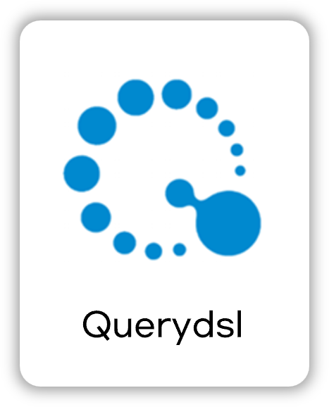
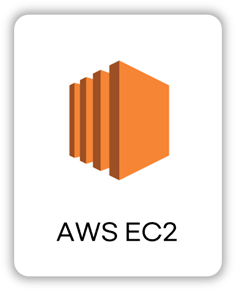

<div align="center">

<!-- logo -->
# CashWalk Back-end Repository 
<div align="center">
  <h1>💰 캐시워크 백엔드 서버 (Spring Boot)</h1>
  <p>실시간 채팅, 포인트 적립, 러닝 기록, 커뮤니티,아두이노를 통한 걸음패턴 분석 등 다양한 기능을 포함한 통합형 백엔드 시스템</p>

  []()
  []()
  <br>
  
  
  
  
  <br>
  
  
  
  
  
  
</div>

</div>

# 🏃‍♂️ CashWalk Server (Spring Boot)

> “**걷기만 해도 돈을 벌고, 건강해진다!**”
> Flutter 기반 CashWalk 클론 앱의 백엔드 서버입니다.
> **걸음 수 적립, 공원 리워드, 커뮤니티, 실시간 채팅, 러닝 기록**을 통합한 건강 리워드 플랫폼입니다.

---

## 🚀 주요 기능

| 기능 영역        | 설명                                                           |
| ---------------- | -------------------------------------------------------------- |
| 👣 걸음 수 적립   | 하루 걸음 수 기반 포인트 적립 (최대 100P), 실시간 누적 관리           |
| 🏞 산책 리워드    | 공원 반경 250m 접근 시 10P 적립 (일 1회 제한)                         |
| 🏃 러닝 기록      | 거리, 시간, 칼로리, 페이스 기록 및 상세 조회                          |
| 💬 캐시톡 채팅    | 친구 간 1:1 STOMP 채팅, 행운 캐시 송수신 기능                          |
| 👥 친구 기능       | 친구 요청/수락/차단, 초대코드 기반 검색                                |
| 📝 커뮤니티        | 게시글, 댓글, 좋아요/싫어요, 북마크, 신고 기능 포함                        |
| 🔔 푸시 알림       | FCM 기반 푸시 알림 (Android/Flutter 대응)                        |
| ⚙️ 걸음패턴 분석   | 아두이노 + 센서를 통해 수집한 보행 데이터를 기반으로 걷기 패턴 분석 및 시각화 |


---

## ⚙️ 기술 스택
### Back-end

<div>



</div>

### Infra

<div>


</div>

### Tools

<div>

</div>

---

## 🔐 JWT 기반 인증

* `/api/auth/login` → JWT 발급 (access + refresh)
* 모든 API는 `Authorization: Bearer <token>` 헤더 필요
* 토큰 만료 시 `/api/auth/refresh` 호출로 갱신

---

## 📦 프로젝트 구조

```
com.example.cashwalk
├── config        # 보안, Redis, WebSocket 설정
├── controller    # API 엔드포인트
├── dto           # 요청/응답 DTO
├── entity        # JPA 엔티티
├── repository    # DB 접근, QueryDSL
├── security      # JWT 인증 처리
├── service       # 비즈니스 로직
└── utils         # 날짜 계산, 알림 등 유틸리티
```

---
## 📁 API 명세서

| 구분              | 문서 링크                                      |
|------------------|-----------------------------------------------|
| 인증/유저 API     | [auth_user_api.md](./API/auth_user_api.md)     |
| 커뮤니티 API      | [community_api.md](./API/community_api.md)     |
| 캐시톡/랭킹 API    | [cashtalk_api.md](./API/cashtalk_api.md)       |
| 동네산책 API    | [walkreward_api.md](./API/walkreward_api.md)   |
| 러닝크루 API      | [runningcrew_api.md](./API/runningcrew_api.md) |

---

## 🖼 시스템 아키텍처


## ☁ 배포 환경

* **서버**: AWS EC2 (Ubuntu 22.04 LTS)
* **배포 방식**: 수동 배포 (scp + systemd)
* **포트 노출**: 8080 → Nginx Reverse Proxy 설정 예정
* **보안**: SSL 인증서 연동 및 CORS 정책 적용

---

## 👤 개발자

| 이름  | 역할                                                    |
| --- | ----------------------------------------------------- |
| 김인호 | 백엔드 전체 설계 및 구현<br>(Spring Boot 100% + Flutter 일부 45%) |
